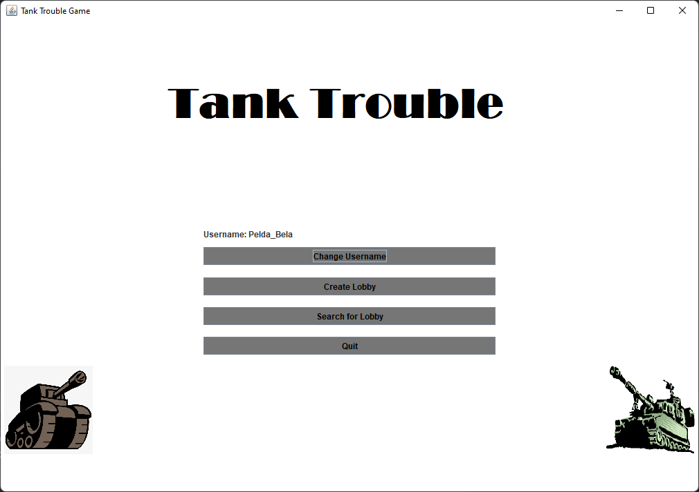
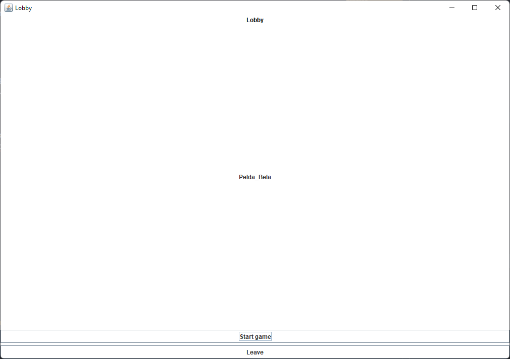
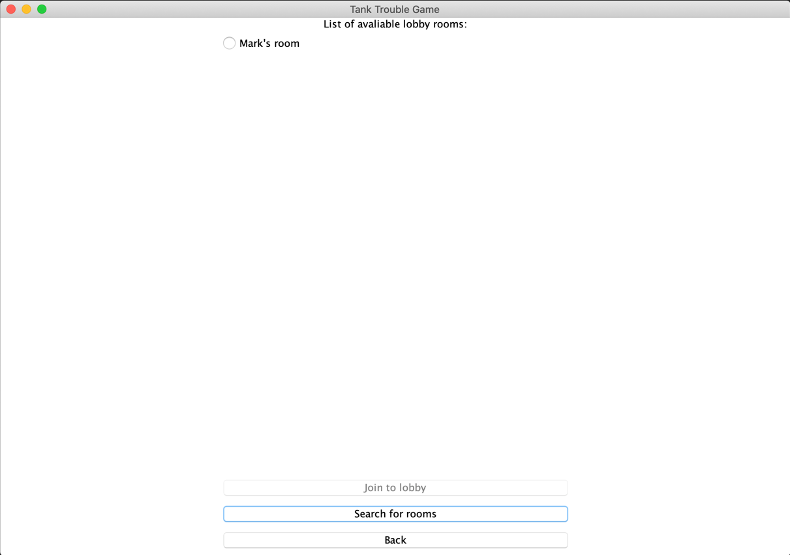
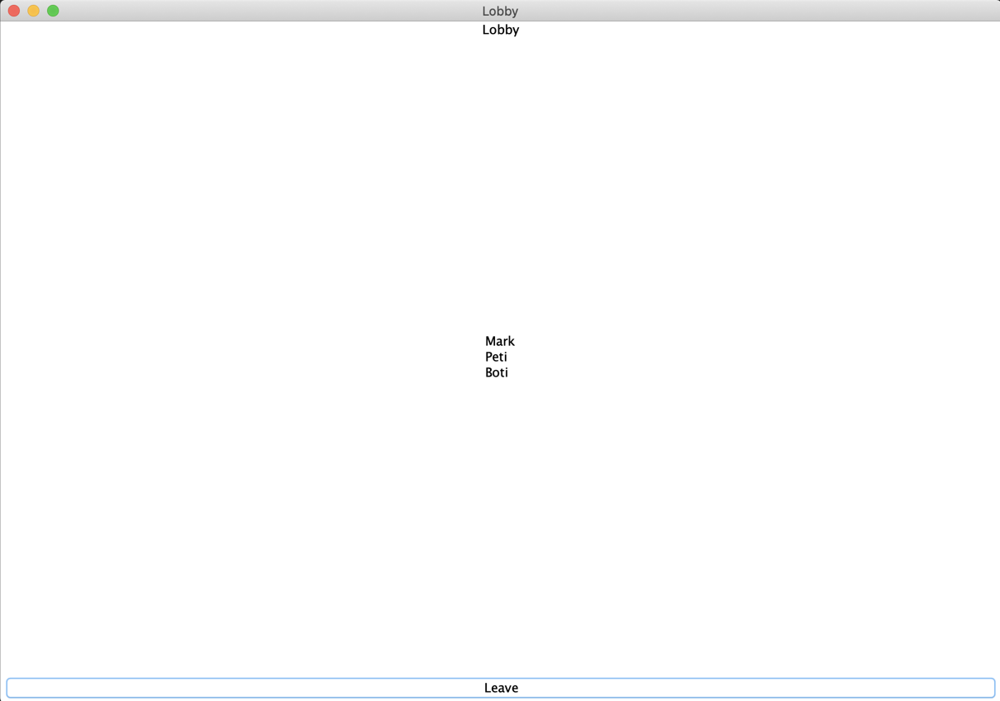
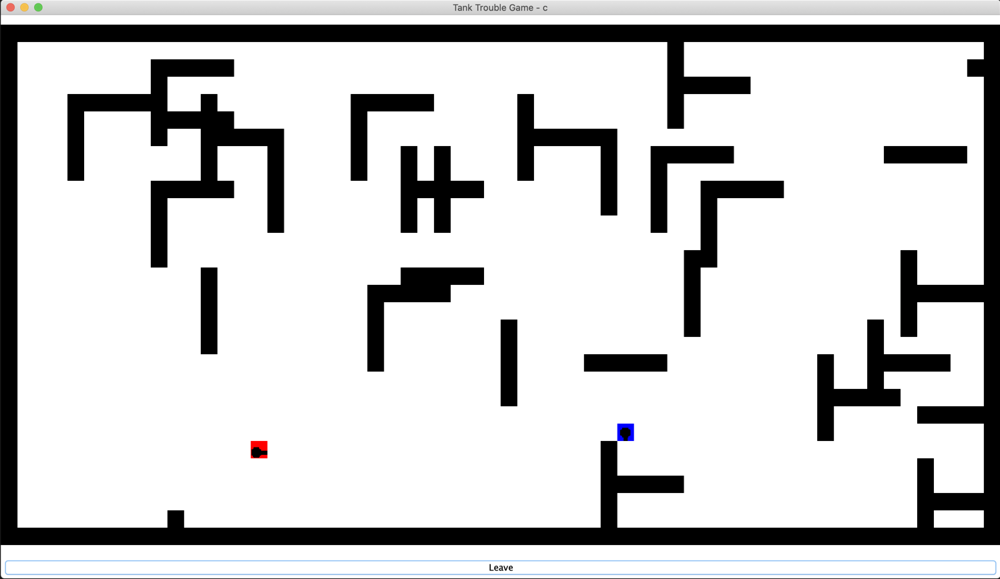

# Felhasználói dokumentáció

## Főmenü

A program megnyitása után a játékosnak először meg kell adnia a felhasználónevét egy felugró ablakban, amivel a játékban fog részt venni. Ebben az ablakban egy maximum 20 karakterből álló csak számokat és angol abc betűit tartalmazó felhasználónevet írhat.

Ezek után a legelső ablak a főmenü, ahol négy lehetőség közül választhat a játékos, amik a következők:
- Felhasználónév megváltoztatása
- Új játék létrehozása
- Játék szobák keresése
- Kilépés a játékból

Ezek a lehetőségek a következő képen láthatóak:

### Játékosnév megváltoztatása

Amennyiben a felhasználó erre a lehetőségre kattint, akkor lehetősége van megváltoztatni a felhasználó nevét, amelyet egy felugró ablakban teheti meg a játék indításakor történő névadáskor leírt szabályokat betartva.

### Új játék létrehozása

Amennyiben a felhasználó ennek a szobának a létrehozása mellett dönt, akkor egy felugró ablakban lehetősége megadni a szobába csatlakozható maximum játékosok számát. Amennyiben ezt megtette a következő ablak lesz látható:

Ekkor ebben az ablakban megjelenik az összes játékos aki a létrehozott szobához csatlakozott. A szoba létrehozójának lehetősége van a játékot elindítani, illetve kilépni a szobából, ezzel megszüntetve a szobát.

### Játék szobák keresése

Amennyiben a ezt a lehetőséget választja a játékos, a következő ablak lesz elérhető számára:

Itt a játékosnak várnia kell pár másodpercet, még a kliens feltérképezi a hálózaton elérhető szervereket. A szobák megjelenítését manuálisan kell végrehajtani a *Search for rooms* gombra kattintva. Amennyiben van elérhető szoba, azok rádió gombok segítségével egymás alatt jelennek meg. Ezek után a csatlakozni kívánt szoba rádió gombjára kattintva elérhetővé válik még egy gomb, név szerint  *Join to lobby* gomb, amivel a játékos becsatlakozhat a szobába. Ha a játkos meggondolta magát vissza is léphet a főmenübe a *Back* gomb megnyomásával.
### Lobby

Miután csatlakoztál egy szobához, ott látod a már csatlakozott játékosok nevét. Amelyet a következő kép is bemutat:

Itt addig kell várni, ameddig a szoba tulajdonosa el nem indítja a játékot vagy ki nem lép a *Leave* gomb megnyomásával.

### Játék

A játék irányítása a következő gombok megnyomásával történik:

- Felfele nyíl : A tank forgatása vagy léptetése 1 mezőt felfel
- Lefele nyíl : A tank forgatása vagy léptetése 1 mezőt lefele
- Balra nyíl : A tank forgatása vagy léptetése 1 mezőt balra
- Jobbra nyíl : A tank forgatása vagy léptetése 1 mezőt jobbra
- SPACE : A tank egy lövedéket lő ki a vele megegyező irányba

Példa: A játékos tankja felfel irányba mutat, majd a játékos jobbra szeretne lépni két mezőt. Ekkor a játékosnak háromszor kell lenyomnia a jobbra nyilat, mivel az első lenyomáskor a tank irányba áll, majd a további két lenyomáskor fogja megtenni a kívánt két mezőt.

A játék lényege, hogy a játékosok lelőjék egymást, végül, pedig az a játékos nyer, aki legutoljára marad.

A játékosnak arra is van lehetősége, hogy kilépjen a *Leave* gomb megnyomásával és ekkor visszadobja a főmenübe. Amennyiben a szoba tulajdonosa lép ki, akkor mindenkit visszadob a főmenübe.