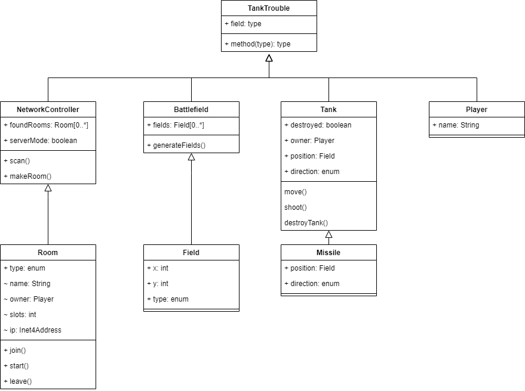

# Tervdokumentáció

## Osztályok

### TankTrouble class

Hello, szhia!

### NetworkController class

Ez az osztály felelős azért, hogy elvégezze a program halózati kommunikációs feladatait. Ezen belül a `scan()` függvény felelős a hálózaton elérhető szobák felderítéséért. Ezt úgy végzi el, hogy socket küldéseket végez egy adott kulccsal (egy előre meghatározott karakter sorozattal) a /24-es subnet címein, és amennyiben egy szerver válaszol a kliens felé, abban az esetben ez az osztály a `foundRoom` atrribútum listájához hozzáfűz egy elemet, ami a felfedezett szoba tula
d

Másik lehetőség, hogy lobby szobát hozzunk létre, amit a `makeRoom()`

### Battlefield class

### Room class

### Field class

### Tank class

### Missile class

### Player class

