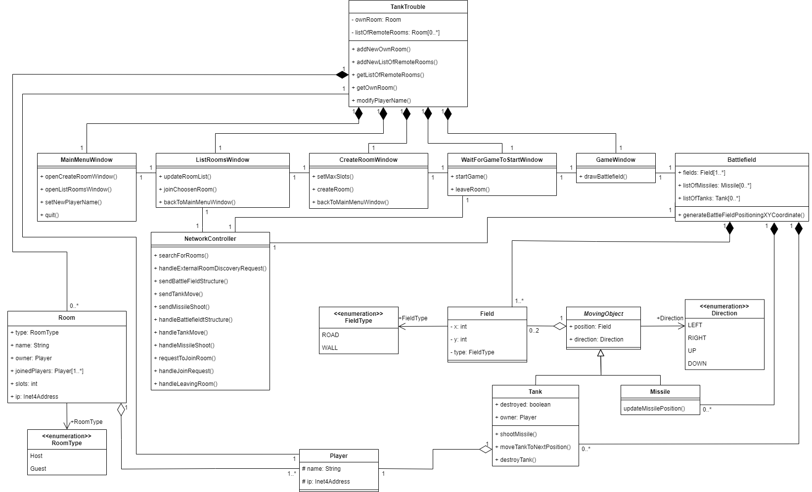

# TankTrouble tervdokumentáció

## Osztályok

### TankTrouble

Az egész program ősosztálya, ennek egy példánya fogja össze a program teljes működését, illetve ez tárolja azokat az adatokat, amikre a többi objektumnak is szüksége lehet.

## Grafikus megjelenítésért felelős osztályok

### MainMenuWindow

A program elindítása után ez a nézet fogadja a felhasználót. Első lépésként egy beviteli mezővel rendelkező *Message Box*-ban meg kell adnia a játékosnevét, majd az új szerver indítása, meglévő szerverhez csatlakozás és kilépés opciók közül választhat. Valamelyik opciót kiválasztva a `MainMenuWindow` nézetet rendre a `ListRoomsWindow` vagy a `CreateRoomWindow` nézet váltja fel, illetve kilép a program.

A játékos neve angol ábécé kis- és nagybetűket, számokat és aláhúzásjelet tartalmazhat. Ez a szöveg nem lépheti túl a maximális 20 karaktert. A játékosnevek esetleges ütközése nem okoz problémát a játék számára, mivel a felhasználók az IP címük alapján vannak azonosítva, a nevet csak a többi játékosnak való megjelenítésre használja a program.

### ListRoomsWindow

Ebben a nézetben jelennek meg a hálózaton elérhető, másik számítógépeken létrehozott játékbeli szobák. Továbbá ebben az ablakban tud a játékos ezekhez a megtalált szobákhoz csatlakozni. Az elérhető szobák felderítéséért a `NetworkController` osztály felelős, a `ListRoomsWindow` a felderítés eredményeként keletkező listát jeleníti meg grafikus formában, illetve üres lista esetén csak az jelenik meg, hogy jelenleg nem érhető el szoba.

A listát gombnyomással frissítheti a felhasználó, visszaléphet a kezdőmenübe vagy egy elérhető szobához csatlakozhat. Egy szoba akkor elérhető, ha sikerült megtalálni a hálózaton, és van benne szabad férőhely (slot). Abban az esetben, ha egy szobában pl. 1 szabad hely van, de két számítógépen is felfedezték, és egyszerre próbálnak csatlakozni, akkor a szerver a hamarabb beérkező kapcsolódást fogadja el, a másodikat pedig visszautasítja. Ilyenkor az utóbbi felhasználó gépén alert-ben üzenet jelenik meg, hogy sikertelen volt a szobához való csatlakozás, és frissül neki az elérhető szobák listája. Hasonló hibaüzenet jelenik meg minden más hálózati kapcsolattal összefüggő csatlakozási hiba esetén is.

Egy szobához való csatlakozás után a felhasználó a `WaitForGameToStart` osztályban megvalósított előszobába (lobby) kerül, ahol a játék elindulására fog várakozni, de továbbra is lehetősége van visszalépni a szobalistára. Ha visszalép a szobalistára, akkor a továbbiakban már nem várakozik a játék indulására.

### CreateRoomWindow

Ebben a nézetben tud a játékos saját szobát (~szervert) indítani. Be kell állítania az elérhető helyeket (slot-ok, 1-nél nagyobb pozitív egész, ebben a számban benne van maga a játékos is). Legalább 2 férőhelynél kevesebbel nincs értelme szobát indítani, emiatt a program figyelmeztetéssel nem engedi létrehozni a szervert. A szoba neve a házigazdáról kapja a nevét, pl. "Albert's room".

A szerver elindítása után a felhasználó a `WaitForGameToStart` osztályban megvalósított előszobába (lobby) kerül, a játékot gombnyomással el tudja indítani akkor, ha rajta kívül legalább 1 másik felhasználó becsatlakozott, illetve a játék automatikusan elindul akkor, ha az összes férőhely betelt a szobában.

A szerver tulajdonosa az előszobában való várakozás közben még leállíthatja a szervert, ilyenkor visszakerül a szerver beállításait tartalmazó nézetre, az esetlegsen becsatlakozott felhasználók pedig a szerverlistára kerülnek.

### WaitForGameToStartWindow

Ebben a nézetben várakoznak a felhasználók a játék indulására/indítására. A csatlakozott játékosok ilyenkor a választott szoba nevét, az összes férőhelyet és a többi becsatlakozott játékos nevét látják. A megjelenő adatok folyamatos frissítéséért a `NetworkController` osztály felelős.

A vendég játékosok vissza tudnak lépni a szerverlistára, a házigazda (host) felhasználó pedig le tudja állítani a szervert, ekkor visszakerül a szerver beállításait tartalmazó nézetre, vagy el tudja indítani a játékot, ha már van legalább 1 becsatlakozott vendég. A játék elindulása esetén a játékosoknak a `GameWindow` nézet válik aktívvá.

### GameWindow

Ebben a nézetben történik a játék érdemi része, itt jelenik meg a pálya, a tankok és a lövedékek. A `GameWindow` feladata a játéktér kirajzolása a `Field` és a `MovingObject` (illetve abból származó) típusú egyedek kirajzoló függvényeinek használatával.

## Játéklogikát implementáló osztályok

### Battlefield

Az osztály feladata a játékmenet összefogása, ez az osztály tartalmazza a csatamezőt alkotó mezőket (`Field`), a játékban még részt vevő tankokat, és a kilőtt, még repülő lövedékeket (a `MovingObject`-ből származó `Tank` illetve `Missile` egyedek).

Ennek az osztálynak a feladata a játék kezdetén a házigazda gépén a csatamező véletlenszerű generálása a specifikációban meghatározott megkötések figyelembevételével. A pályát körben falak szegélyezik. A csatamező `Field` objektumokból épül fel. Továbbá ennek az osztálynak a feladata a játékosok tankjait véletlenszerűen elhelyezni és véletlenszerű irányba fordítani a pályán. A pálya és a tankok helyzetének generálása után a `Battlefield` a `NetworkController`-en keresztül a többi gépre is elküldi a generált felállást.

A `Battlefield` feladata minden lépés (játékos által gombnyomással kiváltott tankmozgás, vagy időalapon kiváltott lövedékmozgás) ellenőrizni a tankok és lövedékek helyzeteit, és ennek függvényében a tankokat illetve lövedéket megszüntetni, adott esetben a játékot befejezni. A játék akkor ér véget, ha egyetlen tank maradt, vagy egyetlen tank sem maradt a játékmezőn. A játék vége, tehát az utolsó előtti vagy a két utolsó tank *megszűnése* egy lövedékmozgás által kiváltott ciklusban tud bekövetkezni.

Ha két tank felé is halad lövedék, és elvileg egyszerre éri el őket (pl. az a felállás, hogy 4 tank van, és 1-1 tank azonos időpontban ad le lövést a velük szemben álló 1-1 tankra), akkor a tankok kiesése a kiértékelések sorrendjében történik meg, de abban az esetben, ha a játékban lévő utolsó két tank egy lövedékpozíció-frissítési ciklusban esik ki, akkor a játék döntetlenként fejeződik be. Ennek megfelelően a játék vége csak akkor dönthető el, ha már az összes lövedék mozgása ki lett értékelve.

A játék végén a felhasználók alert-ben látják a nyertes felhasználó nevét (vagy felhasználók neveit döntetlen esetén), majd azt bezárva a főmenübe kerülnek, de ilyenkor már nem kell új játékosnevet megadniuk.

### Field

A csatamezőt a `Field` objektumok alkotják. Ezek vagy falak lehetnek, vagy utak (`WALL`, `ROAD`). A falakon nem tudnak átmenni a tankok, és a lövedékek is megállnak/megszűnnek bennük. Az utak mentén tudnak a tankok közlekedni, és a lövedékek is ezek mentén tudnak haladni.

A mezőt a játéktér bal felső sarkához (origó) viszonyított `x` és `y` koordinátája azonosítja, az `x` tengely értékei függőlegesen jobbra, az `y` tengely értékei lefele növekednek.

### MovingObject

Ez az absztrakt ősosztály írja le a csatamezőn lévő aktív, mozgó objektumokat, amik a tankok és a kilőtt lövedékek.

Az egyik leszármazottja a tank, ami a pálya `ROAD` mezői mentén mozog. A csatatéren lévő tankok listáját a `Battlefield` objektum tárolja. Minden tank egy játékmezőn (`Field`) tartózkodik, ezt a tagváltozót az ősosztályból örökli, emellett van egy iránya is, ami balra, jobbra, fel- vagy lefele haladás lehet (`LEFT`, `RIGHT`, `UP`, `DOWN`). A tankok akkor mozdulnak, mikor a felhasználó az adott mozgásirányhoz tartozó billentyűt megnyomja, illetve természetesen ha az adott irányhoz tartozó szomszédos mező nem fal. Összeütközés esetén a tankok nem sérülnek, egyik felhasználó tankja sem esik ki a játékból, de a tankok nem tudnak továbbhaladni egymáson keresztül (pl. [5, 5] és [6, 5] pozícióban lévő tankok közül az első nem tud jobbra, míg a másik balra lépni).

A tankok a `space` billentyű lenyomására lövedéket lőnek ki abba az irányba, amerre a legutóbb haladtak, illetve ha még nem mozdultak meg, akkor a pálya létrejöttekor kapott irányukba. Ilyenkor egy `Missile` típusú objektum keletkezik, ami szintén a `MovingObject` leszármazottja. A lövedékek pozíciója periodikusan frissül, a `Battlefield` adott időközönként hívva minden `Missile` `updateMissilePosition` függvényét. Ennek következtében a lövedékek fix, egyenletes sebességgel mozognak (~valahány mező/másodperc). Egy játékmezőn több lövedék is lehet egyidőben, nem ütköznek össze, és nem is befolyásolják egymás mozgását.

A `Battlefield` a hozzá kapcsolódó részben bemutatott esetekben és módon ellenőrzi a játékmezők és a rajtuk lévő mozgó objektumok közötti összefüggéseket: egy lövedék megszűnik akkor, ha fal típusú mezőre ért a mozgása után, vagy tankot tartalmazó mezőre ért a mozgása után, ilyenkor az adott tank is megszűnik.

## Hálózati kapcsolat implementációja

### NetworkController

Ez az osztály felelős a hálózati kommunikáció összefogásáért.

A `NetworkController` objektum feladata hálózaton elérhető szobák felderítése, az alhálózati maszknak megfelelő IP-cím tartományban található összes (kivéve a network és broadcast) címekre küldött TCP/IP csomagokkal abban az esetben, ha a felhasználó vendégként keres szobákat. Ha a felhasználó házigazda, akkor az objektum feladata a vendégek által küldött csomagokra válaszolni a szoba nevével, a férőhelyek számával, és az eddig becsatlakozott felhasználók neveinek listájával (a szerver mindig ezeket az adatokat teszi a válaszba, a kliens pedig a számára éppen szükséges adatokat használja fel az üzenetből, az aktuális nézetnek megfelelően). Ha a felhasználó házigazda, de a szobában már elindult a játék, akkor ez a szolgáltatás megszűnik, és a gép egyáltalán nem reagál a beérkező szoba-létezésre vonatkozó kérdésekre a játék befejezéséig. Ha egy vendég típusú felhasználó már nem szobát keres, hanem becsatlakozott és az előszobában várakozik, akkor nem küld üzenetet az összes címre, hanem csak célirányosan a választott szobához tartozó szerverrel kommunikál.

Szintén ennek az objektumnak a feladata a `Battlefield`-el együttműködve játék közben a csatatéren történt események szinkronizálása a gépek között. Amennyiben egy tank megmozdul (`moveTankToNextPosition`), vagy egy lövedék keletkezik (`shootMissile`), ez az osztály küldi be ezt az információt a szervernek, ami továbbítja azt az összes csatlakozott játékosnak. Ezeknek az adatoknak az ismeretében már minden kliensen külön-külön számítható a játéktér állapota. Ennek megfelelően szintén ennek az objektumnak a feladata fogadni a mozgásokra illetve lövések leadására vonatkozó információkat, és továbbítani azokat a `Battlefield` felé, ami feldolgozza azokat. Ha a felhasználó gépe a szerver, akkor ezen felül még a csatlakozott játékosok listáját is tárolnia kell, és közvetítenie ezeket az üzeneteket minden játékos felé (~broadcast, de csak az adott címekre nézve).

Ide tartozik még a szoba generálásakor a játéktér felépítésére és a tankok pozíciójára és irányára vonatkozó adatok küldése (szerver esetén) vagy fogadása (kliens esetén), és továbbítása a `Battlefield` vezérlő felé.

A `NetworkController` feladata továbbá, hogy kezelje a szobákba való bejelentkezési kérelmeket (`requestToJoinRoom` a klienseken, `handleJoinRequest` a szerveren), és ezeket továbbítsa a `WaitForGameToStartWindow`-nak.

### Room

Ez az osztály írja le a felfedezett szobákat kliens esetén, vagy szerver esetén a létrehozott szobát.

## Munkamegosztás

- Mihalik Márk: GUI és pályagenerálás
- Girgász Péter Ákos: Hálózatkezelés
- Vezse Botond: Játéklogika implementálása